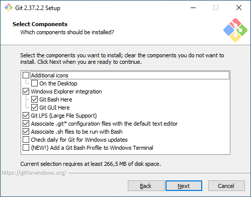
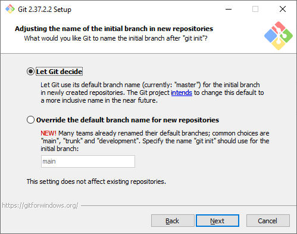
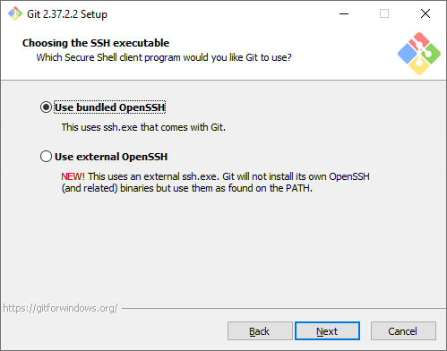
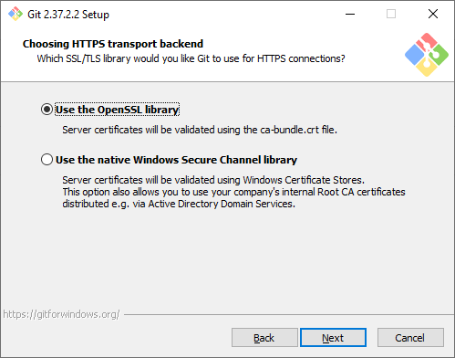
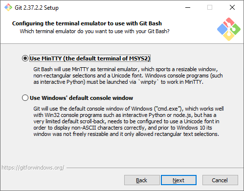
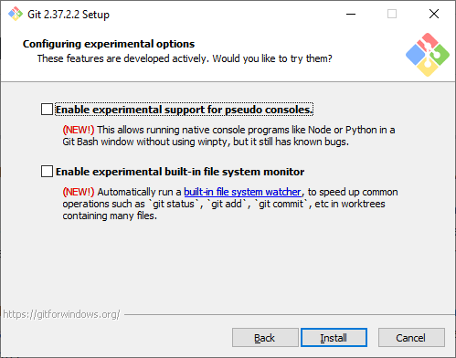

# Инструкция по работе с Git

## Установка Git

### Выбор компонентов

### Текстовый редактор по умолчанию

### Название первой ветки

### Способ использования Git

### Выбор SSH-клиента

### Выбор SSL/TLS библиотеки

### Эмулятор терминала

### Экспериментальные настройки

## Настройка Git

## Основные команды Git

