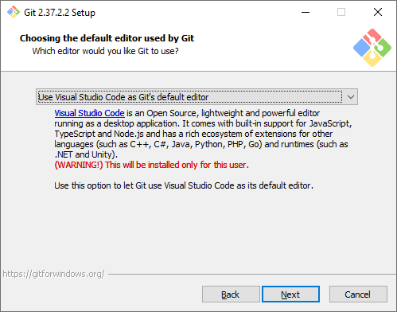
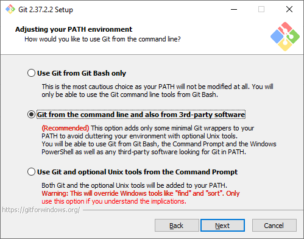

# Инструкция по работе с Git

## Установка Git

### Выбор компонентов

### Текстовый редактор по умолчанию

### Название первой ветки

### Способ использования Git

### Выбор SSH-клиента

### Выбор SSL/TLS библиотеки

### Эмулятор терминала
**Эмулятор**, который будет использоваться в командной строке Git Bash. MinTTY — удобный вариант, поэтому он выбран по умолчанию. Встроенный эмулятор CMD не очень удобен, у него есть некоторые ограничения, поэтому выбирайте его, только если делаете это осознанно.

### Экспериментальные настройки
Эти опции еще не переведены в стабильную стадию, поэтому их использование рекомендуется, только если вы точно понимаете, что делаете. Мы не будем ничего отмечать.

## Настройка Git

## Основные команды Git

